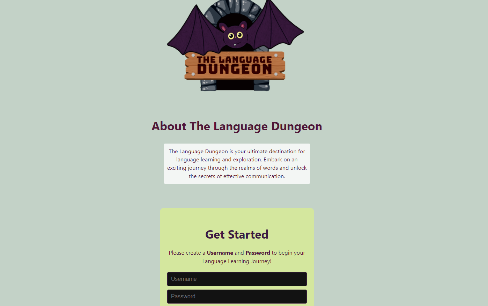

# <The-Language-Dungeon>

## Description

The Language Dungeon is a language learning platform in which students of Spanish can test their knowledge of vocabulary and grammar, and then compare their scores to other users on the platform to motivate their continued practice and learning. The project implements React.js and GraphQL, Mongoose, and MongoDb.

## Installation

No installation required, you can navigate to the deployed website in the section below or clone the repository to run a local version of the site. 

## Usage

Navigate to the project's website: https://lb-dungen.onrender.com/ and create a username and password. From there, navigate to the home page and select to begin a quiz. If you would like to donate to the site, you can click on the 'donate' button in the navbar to donate via Stripe.

## Credits

This project is a UT Coding Bootcamp collaboration between Cecilia Garcia, Andrew Blanchard, Carlos Asencio Morales, Albert Terrazas, and Victoria Greenwood.

Reference for how to add images in react:

Anglemire, C. (2020, July 2). How to Render Images in a React App. Medium. Retrieved May 30, 2024, from https://medium.com/@carlie.anglemire/requiring-images-in-react-9bcf6a8c2cb

Reference for file structure/syntax to create a quiz in react:

Aguilar, J. (2018, September 19). Create a quiz with React. Medium. Joshua Aguilar. Retrieved June 6, 2024, from https://tactician.medium.com/create-a-quiz-with-react-6bd826c04f6
https://tactician.medium.com/create-a-quiz-with-react-6bd826c04f6

Bootcamp Tutors:

Assistance with debugging splash page image and cursor image/functionality
assistance with debugging database queries
assistance with debuggin website deployment

Class instructional team:

Debugging package.json errors, incompatible package versions
Debugging merge conflicts
Debugging server queries returning null values

Claude AI:

Assistance formatting code/logic for rendering quiz questions and answers in QuizContainer component, making it compatible with mongodb, dynamically rendering quizzes by ID

## License

This project uses an MIT license. For more information see the ‘license’ section of the repository or go to https://choosealicense.com/licenses/mit/ 

